<!--  -->

<!-- # Giovanni Argentiero
## Front End Developer 💻

 
-->
<!-- Hi there! 👋🏻 -->

I'm Giovanni Argentiero and I'm a **Freelance Front End Developer**.

I create web applications for enterprises, websites and mobile apps.

I enjoy learning new coding skills almost every day, both in my spare time and at work, as I see programming as an art form.
 

When I write code, I always strive to find ways to optimize it, turning each project into a personal challenge.

<!-- 

### Main skills

- HTML, CSS, JavaScript, TypeScript, Sass
- React, Next.js, Electron, Ionic, Vue.js
- Material UI, Chakra UI, Bootstrap
- Redux, Easy Peasy, React Router, React Query
- Three.js, React Three Fiber
  

- PHP, MySQL
- Node.js, Laravel
  
  -->

### My Experience

#### Tailoor - Full Remote

I'm developing the front end of 3D configurators for both e-commerce and internal use, serving clients in the high-fashion sector.

  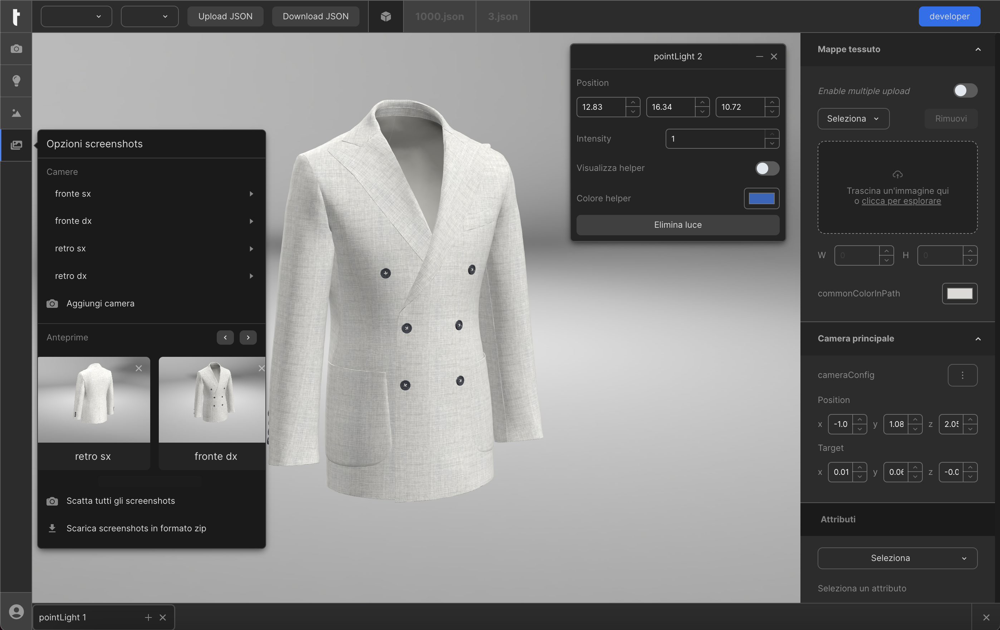
  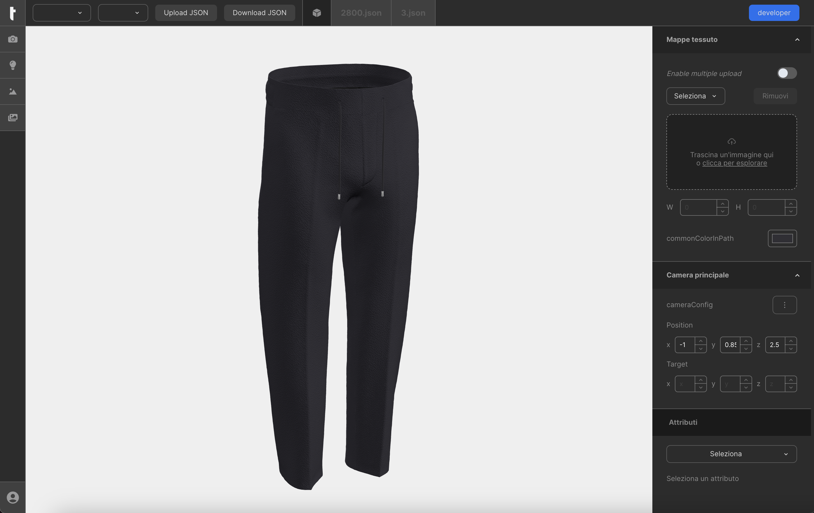
  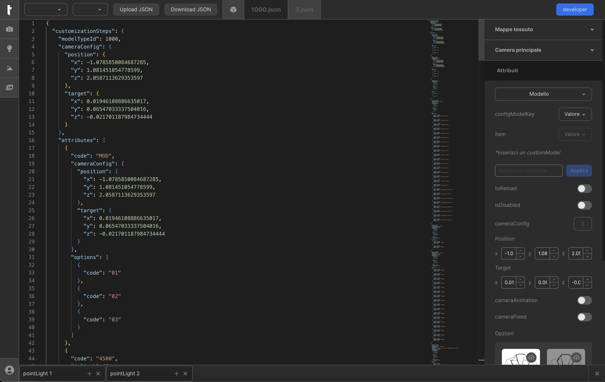

#### Connext - Full Remote

I've built a management software to take reservations with clients, send contracts and start professional activities with them.

  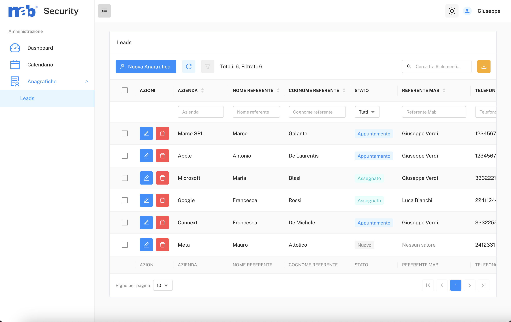
  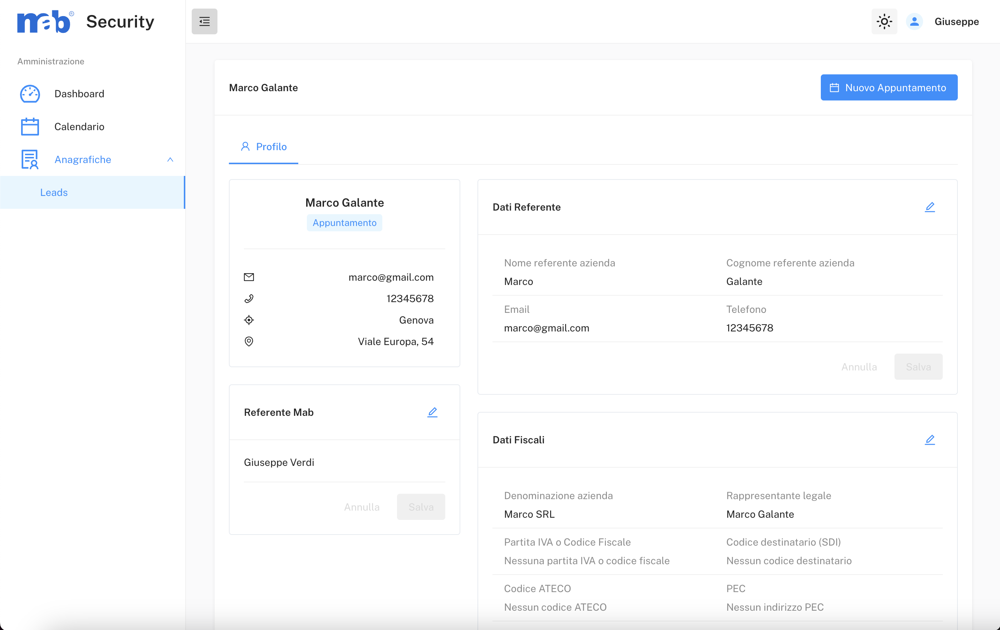
  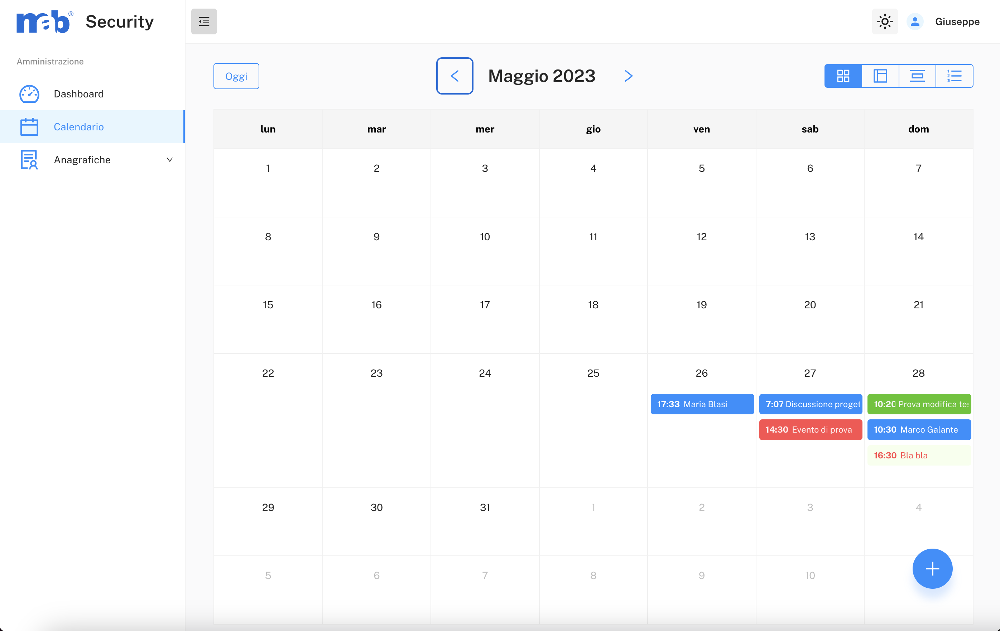

#### Tecnonews - Full Remote

I've built the front end of a management software for a luxury hotel chain, a mobile app demo and website for a supermarket project and 9 showcase websites.

  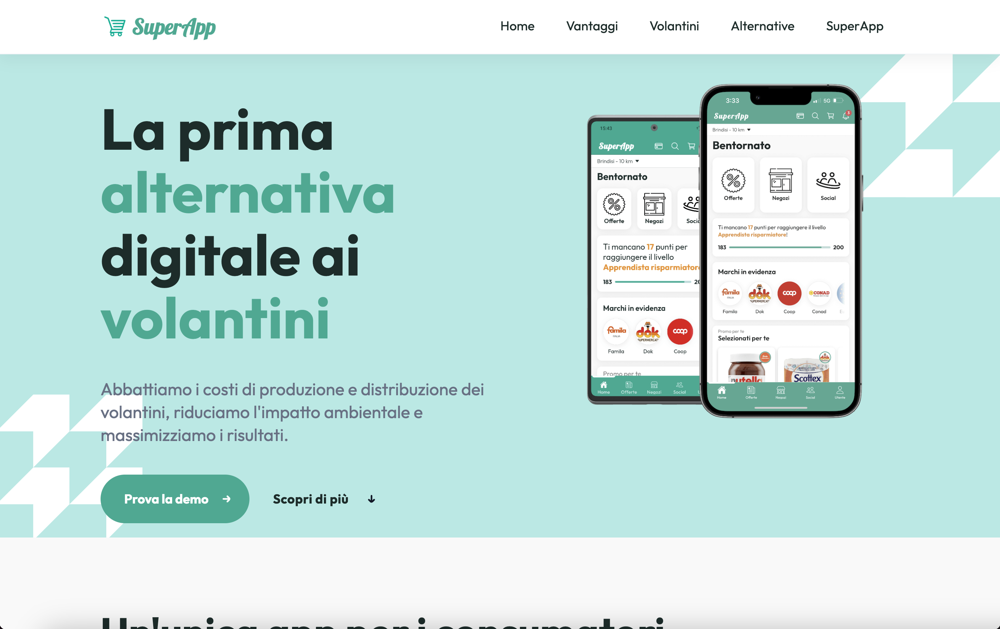
  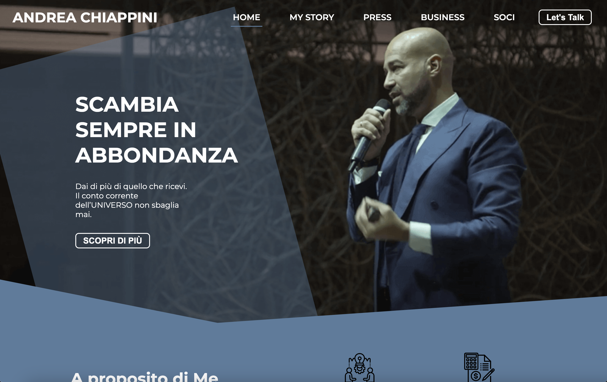
  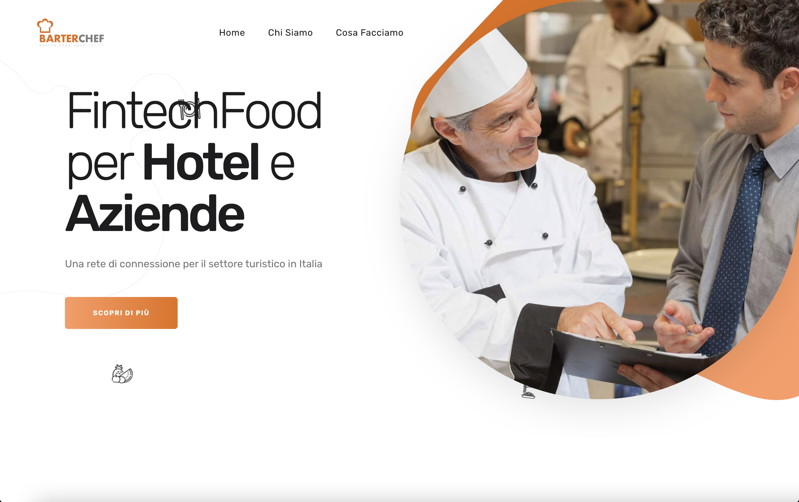
  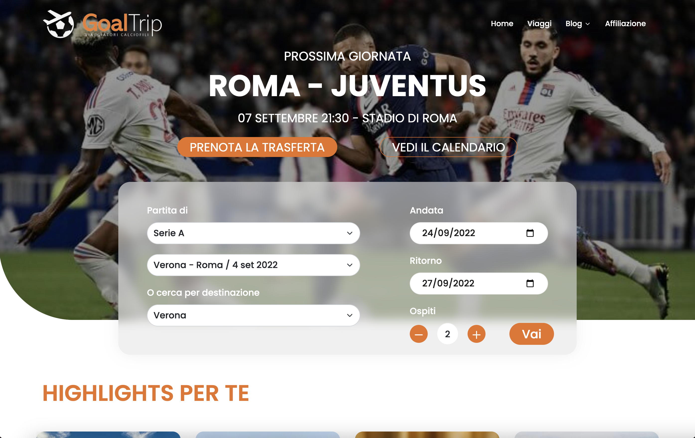
  
  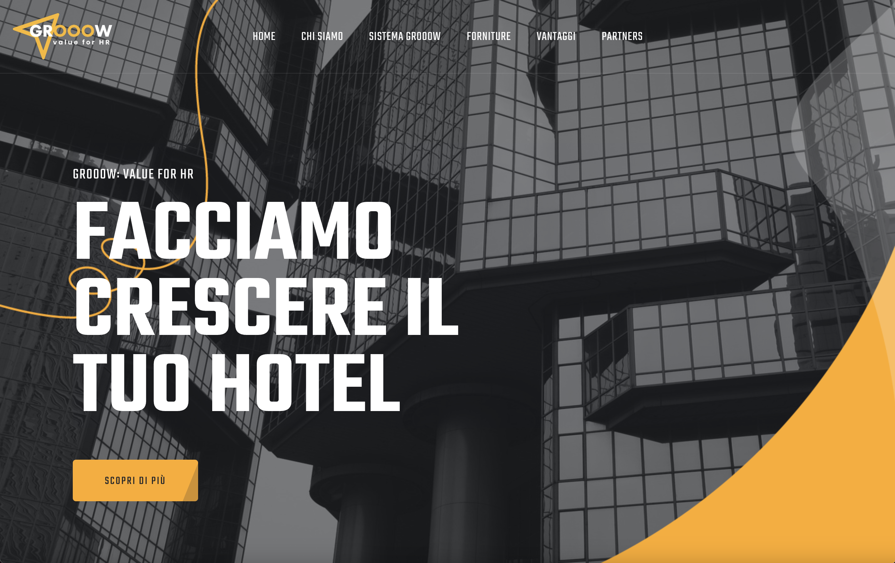

#### Altruistic - Full Remote

I've created the materials for a React academy course: slides, homeworks and real life projects.

  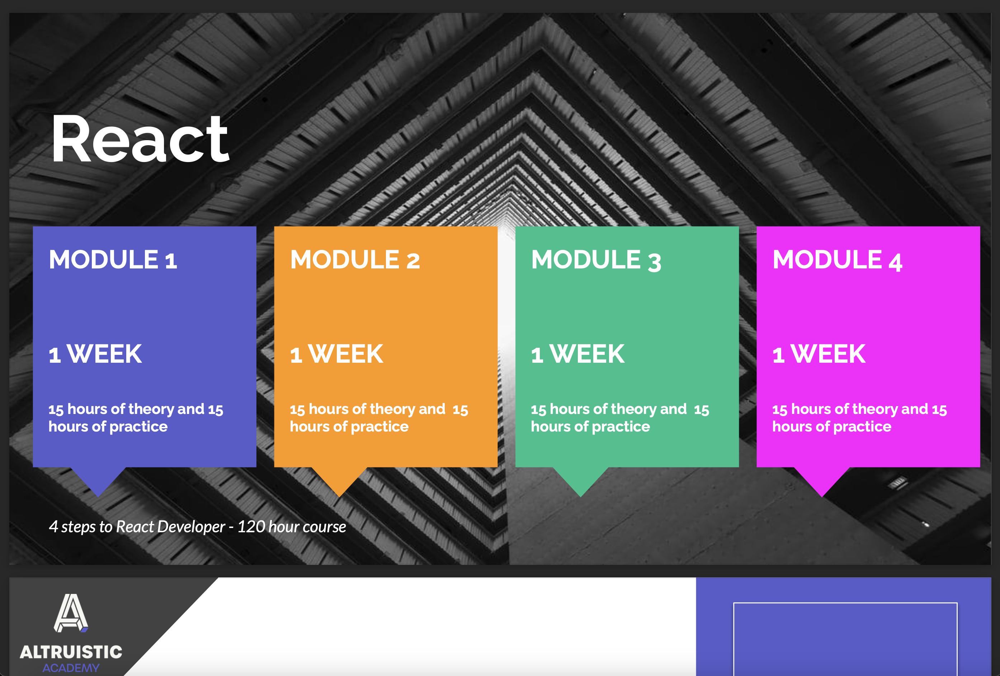
  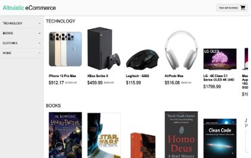
  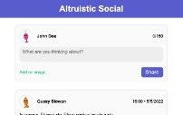

#### Boolean Careers

Boolean is a coding bootcamp where I've learned to build fully working web applications and websites.

  
  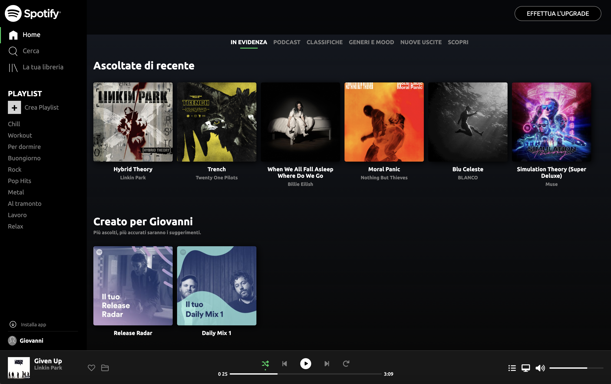
  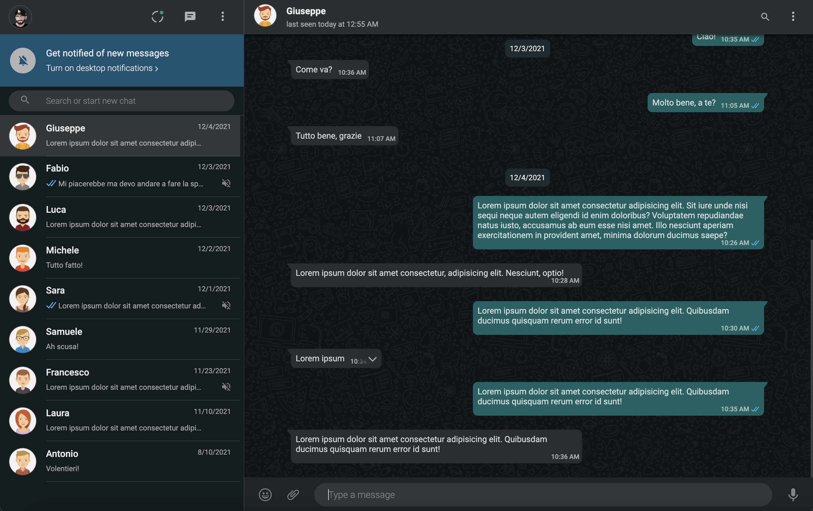

#### G&G Doors and Windows - Full Remote (In office until 09/2021)

I work in general technical support, handling their WordPress website, social media, and graphic content such as catalogs.

#### Woom Italia

I've learned to build websites in WordPress and the basics of HTML, CSS and PHP.

  
 

 

